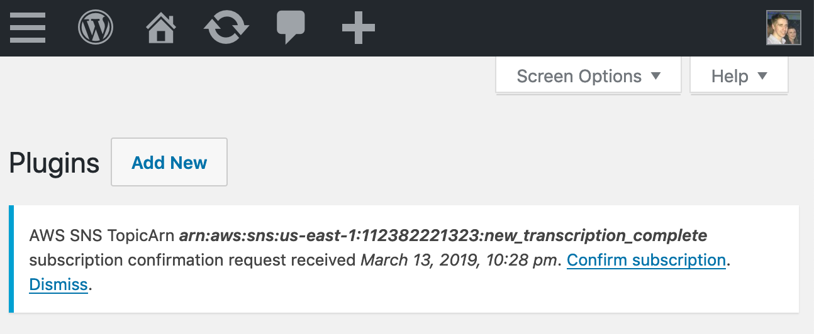
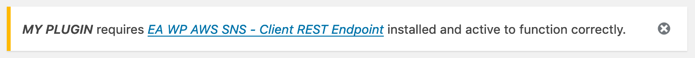

# EA WP AWS SNS - Client REST Endpoint

A [WordPress](https://aws.amazon.com/transcribe/) plugin providing a REST API endpoint to receive messages from [Amazon Web Services Simple Notification Service](https://aws.amazon.com/sns/) for other plugins to consume.

## Purpose

We are using [AWS Transcribe](https://aws.amazon.com/transcribe/) to transcribe videos on [AnabolicTV.com](https://anabolictv.com) and when it completes, AWS SNS communicates to our WordPress install that the job is finished so we can retrieve the output.

If emails from WordPress are sent via [AWS SES](https://aws.amazon.com/ses/) (using [WP SES plugin](https://wordpress.org/plugins/wp-ses/)) a plugin to delete accounts whose email addresses bounce could use this plugin to receive the notifications.

## How To Use

The plugin adds a REST endpoint at `<https://your-website.com>/wp-json/ea/v1/aws-sns/` which should be used when you [create an AWS SNS subscription](https://console.aws.amazon.com/sns/v3/home#/create-subscription).

Once a `SubscriptionConfirmation` request is received, a notice will be displayed in the WordPress admin UI allowing the user to confirm or dismiss.



When a subscription has been confirmed, messages from SNS of type `Notification` will be parsed and fire the `ea_aws_sns_notification` action. 

In your plugin, handle using:

```
add_action( 'ea_aws_sns_notification', 'my_notification_handler', 10, 4 );

/*
 * @param string  $notification_topic_arn  $body->TopicArn
 * @param array   $headers                 HTTP headers received
 * @param object  $body                    HTTP body received
 * @param object  $message                 $body->Message JSON decoded
 */
function my_notification_handler( $notification_topic_arn, $headers, $body, $message ) {

	$my_topic_arn = ...

	if( $my_topic_arn != $notification_topic_arn ) {
		return;
	}
	
	// Handle
}
```

See: [sample notification headers and body](tests/data/notification.json).

## Notes

### Unsubscribing

This plugin does not keep a record of active subscriptions.

Deactivating/uninstalling does not unsubscribe from SNS notifications, but 
[AWS SNS Delivery Policies](https://docs.aws.amazon.com/sns/latest/dg/DeliveryPolicies.html) says:

> Amazon SNS considers HTTP status codes 400 to 499 to indicate permanent delivery failure. 

Notifications do contain a property "UnsubscribeURL" but which needs to be signed by an IAM account with appropriate permissions, thus this plugin cannot handle it.

Plugins using this plugin may have the appropriate IAM credentials, so could store the UnsubscribeURL and use the credentials to cleanly unsubscribe during deactivation and uninstall.

### This Plugin as a Requirement



```
add_action( 'admin_notices', 'admin_notice_requirements' );

function admin_notice_requirements() {

	$my_plugin_name = "MY PLUGIN";

	// Don't irritate users with plugin install suggestions while they're already installing plugins.
	if( isset( $_GET['action'] ) && $_GET['action'] == 'install-plugin' ) {
		return;
	}

	if( ! is_plugin_active( 'ea-wp-aws-sns-client-rest-endpoint/ea-wp-aws-sns-client-rest-endpoint.php' ) ) {

		echo '<div class="notice notice-warning is-dismissible"><p><b><i>'. $my_plugin_name .'</i></b> requires <a href="https://github.com/EnhancedAthlete/ea-wp-aws-sns-client-rest-endpoint"><i>EA WP AWS SNS - Client REST Endpoint</i></a> installed and active to function correctly.</p></div>';
	}
}
```

### Logging

To handle logs, write functions for `ea_log_notice`, `ea_log_info`, `ea_log_debug`, `ea_log_error`:

```
add_action( 'ea_log_info', 'my_info_log_handler', 10, 4 );

function my_info_log_handler( $plugin_name, $plugin_version, $message, $context = array() ) {
	error_log( $message );
}
```

We have an internal logging setup that boils down to this, but isn't yet worth publishing.

## Test

Run `composer install` to install [WP Mock](https://github.com/10up/wp_mock) and [PHP Unit](https://github.com/sebastianbergmann/phpunit) dependencies.

Run `phpunit tests --bootstrap ./tests/bootstrap.php` to test.

## TODO

* Localise time from UTC ("subscription confirmation request received on...")
* Delete subscription requests over 3 days old: [SNS API Reference](https://docs.aws.amazon.com/sns/latest/api/API_Subscribe.html) says 
"Confirmation tokens are valid for three days. "
* Add REST API 'description' for OPTION requests
* i18n
* Non AJAX confirm/dismiss
* An action could be add to allow plugins automatically confirm subscriptions.
* Logging is haphazard so far, could do with systematic approach.
* CI: Code coverage / GitHub release archives / Push to WordPress.org

## Acknowledgements

Built by [Brian Henry](https://BrianHenry.ie) using [WordPress Plugin Boilerplate](https://wppb.me/) and [WP Mock](https://github.com/10up/wp_mock) for:

[](https://EnhancedAthlete.com)